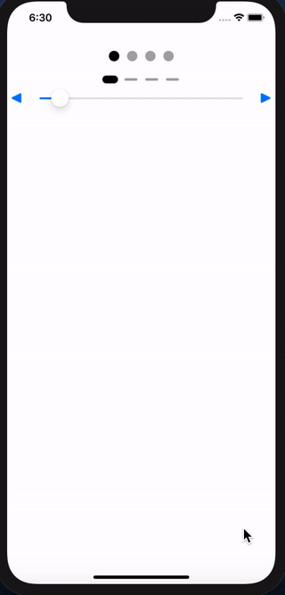

# PageControlView

[](https://cocoapods.org/pods/PageControlView)
[](https://cocoapods.org/pods/PageControlView)
[](https://cocoapods.org/pods/PageControlView)
[](https://developer.apple.com/swift/)

## Introduce

You can change the PageControl to multiple layouts. You can touch it and give it transparency.
You can change the number dynamically.

<br/>

### PageControlView



## Requirements

`PageControlView` written in Swift 5.0. Compatible with iOS 8.0+

## Installation

PageControlView is available through [CocoaPods](https://cocoapods.org). To install
it, simply add the following line to your Podfile:

```ruby
pod 'PageControlView'
```

## Usage

```swift
import PageControlView
```

```swift
let pageControlView = PageControlView()
self.view.addSubview(pageControlView)
```

done!

<br>

### Property

```swift

pageControlView.numberOfPages = 4
pageControlView.currentPage = 1

pageControlView.margin = 20
pageControlView.padding = 12

pageControlView.pageSize = 16

pageControlView.pageWidth = 4
pageControlView.pageHeight = 2
pageControlView.pageRadius = 1

pageControlView.pageIndicatorTintColor = UIColor.lightGray

pageControlView.currentPageWidth = 4
pageControlView.currentPageHeight = 2
pageControlView.currentPageRadius = 1

pageControlView.currentPageIndicatorTintColor = UIColor.black

pageControlView.transparencyColor = UIColor.white
pageControlView.transparencyLeftWidth = 24
pageControlView.transparencyRightWidth = 24

```

### Method

```swift

pageControlView.updateCurrentPage(1, withDuration: 0.3, centerDuration: 0.3)
pageControlView.updateCurrentPage(<#T##currentPage: Int##Int#>, withDuration: <#T##TimeInterval#>, centerDuration: <#T##TimeInterval#>, callback: <#T##(() -> Void)?##(() -> Void)?##() -> Void#>)

```

<br>

### Delegate

```swift

class ViewController: UIViewController{
    override func viewDidLoad() {
        super.viewDidLoad()

        let pageControlView = PageControlView()
        pageControlView.delegate = self
    }
}

// MARK: PageControlViewDelegate
extension ViewController: PageControlViewDelegate {
    func pageControlTap(_ view: PageControlView, index: Int) {

    }
}

```

## Author

pikachu987, pikachu77769@gmail.com

## License

PageControlView is available under the MIT license. See the LICENSE file for more info.
